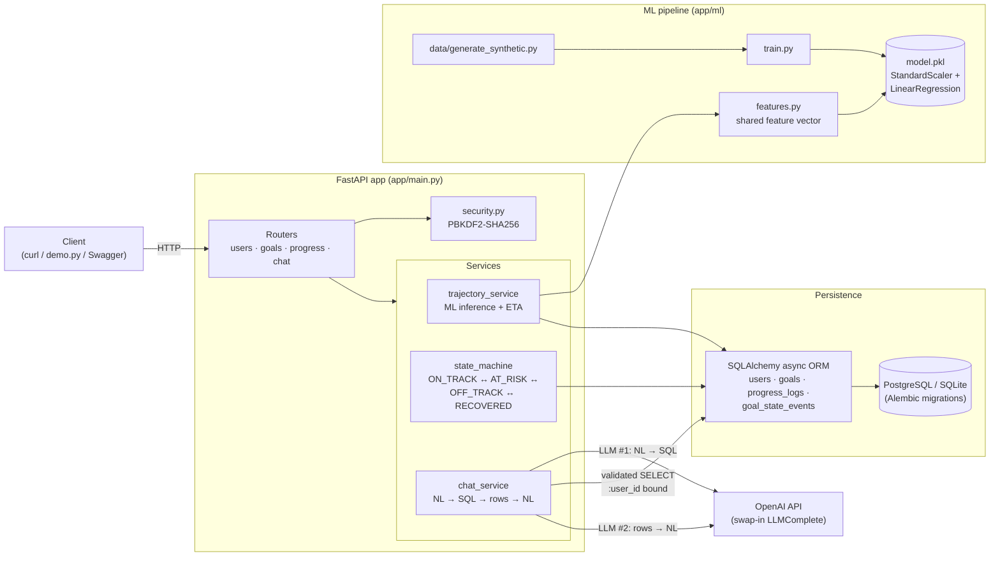

# FitPace

> Backend take-home for **Virtuagym**.
> Stack: **FastAPI · SQLAlchemy (async) · PostgreSQL/SQLite · scikit-learn · OpenAI · Docker · pytest**

FitPace is a small but complete backend service that tracks a user's fitness
goals, projects whether they'll hit them on time, manages a goal state
machine, and exposes a natural-language `/chat` endpoint grounded in the
user's own data via LLM-generated SQL.

---

## 1. Quick start

```bash
# one-time: install deps, generate synthetic data, train the model, init SQLite
make setup

# run the API on http://127.0.0.1:8001
make run

# in another terminal: exercise every endpoint end-to-end
make demo

# run the full test suite
make test
```

Interactive API docs:
- **Swagger UI** – <http://127.0.0.1:8001/docs>
- **Scalar** (nicer enum dropdowns) – <http://127.0.0.1:8001/scalar>

For a live `/chat`, put an OpenAI key in `.env`:

```
OPENAI_API_KEY=sk-...
```

Alternatively, bring up the full Postgres + API stack:

```bash
make docker-up     # starts db + api on :8000
make docker-seed   # generate synthetic data + train model in the container
```

---

## 2. What it does

| Capability | How |
| --- | --- |
| User signup + login | PBKDF2-SHA256 password hashing (600k iterations, stdlib only, no external auth deps) |
| Goal CRUD | `weight_loss`, `strength_gain`, `step_goal` with unit enums |
| Progress ingestion | Append-only time-series per goal |
| **Trajectory projection** | scikit-learn `StandardScaler + LinearRegression` pipeline predicts a 0–100 pace score; ETA derived from the fitted rolling slope |
| **Goal state machine** | `ON_TRACK ↔ AT_RISK ↔ OFF_TRACK ↔ RECOVERED`, auditable through `goal_state_events` |
| **Natural-language chat** | LLM generates a `:user_id`-scoped SELECT against the DB, results are fed back into a second LLM call to produce a grounded answer (computes BMI from height + weight, derives age from DOB) |
| Data + model bootstrap | `data/generate_synthetic.py` → `app/ml/train.py` → `model.pkl` |
| Migrations | Alembic (versions committed under `migrations/`) |

---

## 3. API surface

| Method | Path | Purpose |
| --- | --- | --- |
| `GET`  | `/health` | Liveness + `model_loaded` flag |
| `POST` | `/users` | Signup (name, email, password, optional DOB/height/weight/sex) |
| `POST` | `/users/login` | Verify credentials, return the user |
| `GET`  | `/users/{id}` | Fetch profile (never exposes `password_hash`) |
| `POST` | `/goals` | Create a goal; defaults to `ON_TRACK` |
| `GET`  | `/goals/{id}` | Read a goal |
| `GET`  | `/goals/{id}/trajectory` | ML-backed `pace_score`, `eta_date`, `days_ahead` |
| `GET`  | `/goals/{id}/history` | State-transition audit trail |
| `POST` | `/progress` | Log a data point; triggers trajectory recompute + state update once ≥2 logs exist |
| `GET`  | `/progress/{goal_id}` | List all logs for a goal |
| `POST` | `/chat` | Natural-language question → SQL → grounded answer |

[`scripts/demo.py`](./scripts/demo.py) walks through every one of these in order
with printed request/response pairs — it doubles as executable documentation.

---

## 4. Architecture at a glance



```
app/
├── main.py                      FastAPI entry, router registration
├── config.py                    pydantic-settings (.env-driven)
├── database.py                  Async engine + session factory
├── security.py                  PBKDF2-SHA256 password hashing (stdlib)
├── models/                      SQLAlchemy ORM
│   ├── user.py  goal.py  progress_log.py  goal_state_event.py
│   └── enums.py                 GoalType, GoalUnit, GoalState, Sex
├── schemas/                     Pydantic request/response
├── routers/                     users · goals · progress · chat
├── services/
│   ├── trajectory_service.py    ML inference + ETA
│   ├── state_machine.py         ON_TRACK / AT_RISK / OFF_TRACK / RECOVERED
│   └── chat_service.py          NL question → SQL → rows → NL answer
└── ml/
    ├── features.py              Shared feature engineering (train == inference)
    ├── train.py                 Fits and persists model.pkl
    └── model.pkl                Pickled Pipeline (StandardScaler + LinearRegression)

data/
└── generate_synthetic.py        Creates 200 synthetic goals × demographics
                                 with realistic on/off-pace noise + plateaus

migrations/versions/              Alembic migrations (initial + user-profile)
scripts/                          demo.py (end-to-end walkthrough) + init_db.py
tests/
├── unit/                         17 tests: features, services, security, config, chat SQL safety
└── api/                          API tests against an in-memory SQLite DB
```

### Design choices worth calling out

- **Shared feature vector between training and inference** (`app/ml/features.py`).
  The same `build_feature_vector` runs on synthetic rows during training
  *and* on a live goal inside `compute_trajectory`, eliminating
  train/serve skew.
- **User profile fed into the model.** `user_age` (derived from DOB),
  `user_height_cm`, `user_weight_kg`, and `user_sex_code` are first-class
  features alongside the rolling-slope signal. The synthetic generator
  correlates a mild age penalty with actual progress so the features carry
  real signal rather than just being along for the ride.
- **Neutral-fallback on `<2` logs.** `compute_trajectory` returns
  `pace_score=50` and the target date as a placeholder ETA when it can't fit
  a slope — the progress router explicitly skips state-machine updates in
  that regime so a single log never accidentally tips a goal `OFF_TRACK`.
- **Dependency-injected LLM.** The chat router depends on `get_llm()`,
  which returns a callable `LLMComplete = (system, user) -> str`. Tests
  override this via FastAPI `dependency_overrides` and inject a fake,
  so the chat pipeline is fully unit-tested with zero network calls.
- **SELECT-only, parameter-bound chat SQL.** The LLM is explicitly instructed
  to emit a single SELECT using a `:user_id` bind parameter. On top of the
  prompt, `validate_sql()` enforces, in order:
  1. Strip code fences and trailing semicolons; reject anything empty.
  2. Reject multi-statement payloads (no interior `;`).
  3. First token must be `SELECT` or `WITH`.
  4. Reject any forbidden keyword
     (`INSERT/UPDATE/DELETE/DROP/ALTER/TRUNCATE/CREATE/GRANT/REVOKE/…`).
  5. **Require** the `:user_id` bind parameter to appear in the query — without
     this a compliant SELECT could still leak another user's rows
     (e.g. `SELECT weight_kg FROM users LIMIT 1`).

  Then `:user_id` is rebound server-side with SQLAlchemy's `PGUUID` type
  (`as_uuid=True`) so the value comes from the request body — the LLM never
  gets to inline a UUID. Rows are coerced to JSON-safe primitives and capped
  at 50 before being stuffed into the answer prompt.
- **Profile-aware answers.** When the question touches body composition or
  health, the SQL prompt nudges the LLM to fetch the full profile in one shot
  (height, weight, DOB, sex), and the answer prompt instructs it to compute
  BMI with the standard bands and derive age from DOB — so a single query
  produces a multi-signal reply rather than a one-number drive-by.

### Data flow: `POST /progress`

```
client ─► /progress ──► insert ProgressLog
                └────► if len(logs) >= 2:
                        ├─ compute_trajectory(goal, logs, user=user)
                        │     └─ build_feature_vector
                        │           └─ model.predict → pace_score
                        │     └─ eta = today + (target - current) / slope
                        └─ apply_transition(goal, pace_score, db)
                              └─ emits GoalStateEvent on state change
```

### Data flow: `POST /chat`

```
client ─► /chat(question, user_id)
         ├─ LLM call #1 (schema + question) → SQL
         ├─ validate_sql → reject anything but a safe SELECT
         ├─ execute with :user_id bound (PGUUID type)
         ├─ coerce rows to JSON-safe primitives, cap at 50
         └─ LLM call #2 (question + rows) → natural-language answer
```

---

## 5. Testing

```bash
make test
# 56 passed in ~2s
```

- **Unit tests** cover feature engineering, trajectory service (incl. user-
  profile plumbing), state machine transitions, password hashing, config
  loading, database setup, and chat-service SQL validation (including
  adversarial inputs).
- **API tests** run against an in-memory SQLite DB, exercising the full HTTP
  surface including signup / login edge cases, duplicate email handling,
  progress-triggered recomputation, chat with an injected fake LLM, the
  503-when-no-LLM path, and rejection of malicious SQL.

The test suite is entirely offline: no OpenAI key, no external Postgres, no
network needed.

---

## 6. Implemented vs. deferred

### Implemented

- Users (signup, login, profile) with hashed passwords
- Goals, progress logs, state events + audit trail
- ML trajectory projection (R² ≈ 0.65 on held-out synthetic data) with
  user-profile features
- Goal state machine with explicit transition rules and history
- `/chat` with LLM-generated SQL + SELECT-only validator
- End-to-end demo script and Makefile
- Docker Compose stack (Postgres + API)
- Alembic migrations
- 56-test suite

### Deferred (explicit next steps)

- **APScheduler nightly job** — the spec includes a daily background
  recompute pass over every active goal. The service functions
  (`compute_trajectory`, `apply_transition`) are already factored so wiring
  it up is a ~20-line scheduler job.
- **Static `X-API-Key` header** — already wired through config
  (`Settings.api_key`) but not enforced by a dependency. A single
  `Depends(verify_api_key)` on each router would close this.
- **Ollama fallback for `/chat`** — the codebase treats the LLM as a
  swap-in callable; adding an Ollama adapter is mechanical. Today an
  absent `OPENAI_API_KEY` returns a clean `503` from `/chat`.
- **Authentication proper** — signup/login return the user today but no
  session/JWT is issued. The spec marked real auth out of scope; for
  production, a JWT layer on top of the existing `security.py` helpers
  would be the natural extension.

---

## 7. Repo tour for reviewers

Most worth reading, in order:

1. [`context.md`](./context.md) — the spec I worked against.
2. [`app/services/trajectory_service.py`](./app/services/trajectory_service.py)
   — ML inference with model-cache invalidation + user-profile plumbing.
3. [`app/services/chat_service.py`](./app/services/chat_service.py) — the
   SELECT-only SQL pipeline; see `validate_sql` and `execute_sql`.
4. [`app/services/state_machine.py`](./app/services/state_machine.py) — the
   transition rules and event emission.
5. [`app/ml/features.py`](./app/ml/features.py) — the shared feature vector
   used by both training and inference.
6. [`tests/api/test_endpoints.py`](./tests/api/test_endpoints.py) — how the
   pieces fit together over HTTP.
7. [`scripts/demo.py`](./scripts/demo.py) — runnable tour of every endpoint.

---

## 8. FAQ for reviewers

**`/chat` returned `rows: []` and the model said it doesn't know — is that a bug?**
No, that's the user-scoping working. Every chat SQL is required to filter by
`:user_id` (validator rule 5 above), and the bind value comes from the request
body — the LLM never gets to inline a UUID. So if the supplied `user_id`
doesn't exist in the DB you're hitting, you get an empty result set and an
honest "I don't know" rather than someone else's data. A common cause is
running `docker compose down -v` (which wipes the Postgres volume) and then
querying with a `user_id` from before the wipe; create a fresh user via
`POST /users` and use the returned `id`.

**`make run` and `docker compose up` give different answers — why?**
They point at different databases on different ports.
- `make run` → port `:8001`, SQLite at `./fitpace.db` (developer convenience).
- `docker compose up` → port `:8000`, dockerised Postgres on a named volume.

Pick one per session. `make demo` always targets `:8001`; for the Postgres
stack run the demo with `BASE_URL=http://127.0.0.1:8000 make demo`.

**Trajectory came back `pace_score: 50` after creating the goal — broken?**
No. The trajectory service needs ≥2 logs to fit a slope; until then it
returns a neutral fallback (`pace_score=50`, `eta_date=target_date`) and the
state machine is intentionally skipped so a single log can't tip a goal
`OFF_TRACK`. Post a couple of logs and the score becomes a real ML
prediction.

---

## 9. One-line environment reference

| Variable | Default | Meaning |
| --- | --- | --- |
| `DATABASE_URL` | `postgresql+asyncpg://fitpace:fitpace@db:5432/fitpace` | Async SQLAlchemy URL. Override with `sqlite+aiosqlite:///./fitpace.db` for local dev (what `make run` uses). |
| `OPENAI_API_KEY` | *(unset)* | Enables `/chat`. Without it, `/chat` returns 503. |
| `API_KEY` | `dev-secret-key` | Reserved for the static-header auth described in the spec (not yet enforced). |
| `SCHEDULER_ENABLED` | `true` | Reserved for the nightly APScheduler job. |
| `LOG_LEVEL` | `INFO` | Root logger level. |
