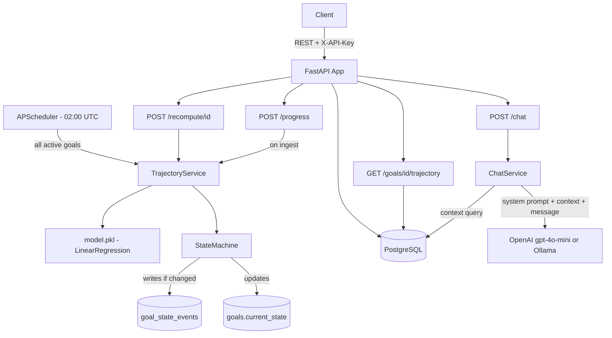

# FitPace API — Project Specification
> Backend-focused internship assignment for Virtuagym
> Stack: FastAPI · PostgreSQL · scikit-learn · APScheduler · OpenAI/Ollama · Docker Compose
> Estimated build time: 5–7 days

---

## 1. Project Overview

FitPace is a backend API service that tracks a user's fitness goal progress, computes a live trajectory toward that goal, manages a goal state machine (ON_TRACK / AT_RISK / OFF_TRACK / RECOVERED), and exposes a conversational `/chat` endpoint that lets users ask natural language questions about their own progress data.

The system is seeded with synthetic data and uses a simple linear regression model (trained offline) to project goal completion dates and compute daily pace scores.

---

## 2. Goals & Non-Goals

### In Scope
- REST API with full CRUD for users and goals
- Progress ingestion endpoint (daily log entries)
- Trajectory projection using a trained scikit-learn linear regression model
- Goal state machine with transition logic and history
- Daily trajectory recomputation via APScheduler background job
- Conversational `/chat` endpoint using context-stuffed LLM prompts (no RAG, no vector store)
- Synthetic data generation script to seed the database and train the model
- Docker Compose setup (api + db)
- Full test suite: unit, integration, and API tests

### Out of Scope
- Frontend / UI
- Real Virtuagym API integration (stubbed with synthetic data)
- RAG / vector store
- Authentication (use a simple static API key header for demo purposes)

---

## 3. Directory Structure

```
fitpace/
├── app/
│   ├── main.py                  # FastAPI app entry point, router registration
│   ├── config.py                # Settings via pydantic-settings (.env)
│   ├── database.py              # SQLAlchemy async engine + session factory
│   ├── models/
│   │   ├── user.py              # SQLAlchemy ORM: User
│   │   ├── goal.py              # SQLAlchemy ORM: Goal
│   │   ├── progress_log.py      # SQLAlchemy ORM: ProgressLog (time-series)
│   │   └── goal_state_event.py  # SQLAlchemy ORM: GoalStateEvent (audit trail)
│   ├── schemas/
│   │   ├── user.py              # Pydantic request/response schemas
│   │   ├── goal.py
│   │   ├── progress_log.py
│   │   └── chat.py
│   ├── routers/
│   │   ├── users.py             # POST /users, GET /users/{id}
│   │   ├── goals.py             # POST /goals, GET /goals/{id}, GET /goals/{id}/trajectory
│   │   ├── progress.py          # POST /progress, GET /progress/{goal_id}
│   │   ├── trajectory.py        # GET /trajectory/{goal_id}
│   │   └── chat.py              # POST /chat
│   ├── services/
│   │   ├── trajectory_service.py   # Core pacing logic + regression inference
│   │   ├── state_machine.py        # Goal state transitions
│   │   ├── chat_service.py         # Context builder + LLM call
│   │   └── scheduler.py            # APScheduler job: nightly recompute
│   └── ml/
│       ├── train.py             # Train and serialize the regression model
│       └── model.pkl            # Serialized trained model (committed to repo)
├── data/
│   └── generate_synthetic.py    # Generate synthetic users, goals, progress logs
├── migrations/
│   └── (Alembic migration files)
├── tests/
│   ├── unit/
│   │   ├── test_state_machine.py
│   │   └── test_trajectory_service.py
│   ├── integration/
│   │   └── test_goal_flow.py    # Full goal lifecycle with freezegun
│   └── api/
│       └── test_endpoints.py    # httpx AsyncClient API tests
├── docker-compose.yml
├── Dockerfile
├── .env.example
├── requirements.txt
├── alembic.ini
└── README.md
```

---

## 4. Database Schema

### Table: `users`
| Column | Type | Notes |
|--------|------|-------|
| id | UUID PK | auto-generated |
| name | VARCHAR | |
| email | VARCHAR | unique |
| created_at | TIMESTAMPTZ | server default now() |

### Table: `goals`
| Column | Type | Notes |
|--------|------|-------|
| id | UUID PK | |
| user_id | UUID FK | -> users.id |
| goal_type | ENUM | weight_loss, strength_gain, step_goal |
| start_value | FLOAT | e.g. 85.0 (kg) |
| target_value | FLOAT | e.g. 80.0 (kg) |
| unit | VARCHAR | kg, kg_1rm, steps |
| start_date | DATE | |
| target_date | DATE | |
| current_state | ENUM | ON_TRACK, AT_RISK, OFF_TRACK, RECOVERED |
| created_at | TIMESTAMPTZ | |

### Table: `progress_logs`
| Column | Type | Notes |
|--------|------|-------|
| id | UUID PK | |
| goal_id | UUID FK | -> goals.id |
| logged_at | TIMESTAMPTZ | index this column |
| value | FLOAT | measured value (e.g. 84.2 kg) |
| notes | TEXT | optional free text |

### Table: `goal_state_events`
| Column | Type | Notes |
|--------|------|-------|
| id | UUID PK | |
| goal_id | UUID FK | -> goals.id |
| from_state | ENUM | |
| to_state | ENUM | |
| pace_score | FLOAT | score that triggered the transition |
| occurred_at | TIMESTAMPTZ | server default now() |
| reason | TEXT | human-readable reason string |

---

## 5. Core Logic

### 5.1 Synthetic Data Generation (`data/generate_synthetic.py`)

Generate 200 synthetic users, each with one goal. Three archetypes:

```python
ARCHETYPES = {
    "weight_loss":   {"start": 85.0, "target": 80.0, "unit": "kg",     "days": 60},
    "strength_gain": {"start": 60.0, "target": 80.0, "unit": "kg_1rm", "days": 90},
    "step_goal":     {"start": 5000, "target": 8000, "unit": "steps",  "days": 30},
}
```

Each user's daily progress is generated as:
```
value(day) = start + (target - start) * (day / total_days)
           + gaussian_noise(mean=0, std=noise_factor)
           + plateau_effect(day)   # zero delta for 5-10 random consecutive days
```

Output: insert directly into the DB via SQLAlchemy. Also export `data/synthetic_progress.csv` for model training.

### 5.2 Model Training (`app/ml/train.py`)

Features per (goal, day) record:
- `days_elapsed` - days since goal start date
- `current_value` - latest logged value
- `rolling_7d_avg` - 7-day rolling mean of values
- `rolling_7d_slope` - slope of linear regression on last 7 values (units/day)
- `pct_progress` - (current - start) / (target - start), capped at 1.0
- `days_remaining` - (target_date - today).days

Target label `pace_score` computed from ground truth:
```
required_rate = (target - start) / total_days        # units per day needed
actual_rate   = rolling_7d_slope                     # units per day achieved
pace_score    = clip(100 * actual_rate / required_rate, 0, 100)
```

Train `sklearn.linear_model.LinearRegression`. Serialize with `joblib.dump` to `app/ml/model.pkl`.
Log R2 and MAE to stdout. Commit `model.pkl` to the repo so the API loads it at startup without retraining.

### 5.3 Trajectory Service (`app/services/trajectory_service.py`)

```python
class TrajectoryResult(BaseModel):
    goal_id: UUID
    pace_score: float          # 0-100
    eta_date: date | None      # projected completion date; None if stalled
    days_ahead: int            # positive = ahead of schedule, negative = behind
    computed_at: datetime

def compute_trajectory(goal_id: UUID, db: Session) -> TrajectoryResult:
    # 1. Fetch goal + all progress_logs ordered by logged_at ASC
    # 2. If fewer than 2 logs: return pace_score=50, eta_date=target_date
    # 3. Compute rolling_7d_slope via np.polyfit on last min(7, n) logs
    # 4. Build feature vector, call model.predict([features])
    # 5. Compute ETA: remaining_delta / rolling_7d_slope (if slope > 0)
    # 6. Return TrajectoryResult
```

### 5.4 Goal State Machine (`app/services/state_machine.py`)

Transition rules evaluated in order:

| Condition | New State |
|-----------|-----------|
| pace_score >= 80 | ON_TRACK |
| 60 <= pace_score < 80 | AT_RISK |
| pace_score < 60 | OFF_TRACK |
| was OFF_TRACK + pace_score >= 70 for 2 consecutive recomputes | RECOVERED |

```python
def evaluate_transition(goal: Goal, new_pace_score: float, recent_events: list[GoalStateEvent]) -> GoalState:
    # Returns the new state based on rules above
    ...

def apply_transition(goal: Goal, new_state: GoalState, pace_score: float, db: Session) -> GoalStateEvent | None:
    # Only writes a GoalStateEvent row if state actually changed
    # Updates goal.current_state in-place
    # Returns the new event or None if no change
    ...
```

### 5.5 Scheduler (`app/services/scheduler.py`)

Use `APScheduler` with `AsyncIOScheduler`:
- Job: `nightly_recompute` runs daily at 02:00 UTC
- For every goal with current_state != COMPLETED: call compute_trajectory -> evaluate_transition -> apply_transition
- Log number of goals processed and any state changes to stdout

Register the scheduler in `app/main.py` lifespan context manager.

### 5.6 Chat Service (`app/services/chat_service.py`)

No RAG. No vector store. Pure context-stuffing:

```python
def build_context(goal: Goal, logs: list, events: list, trajectory: TrajectoryResult) -> str:
    """
    Renders a structured ~200 token context block:
    - Goal type, start/target/current values, unit, deadline
    - Current state and pace score
    - ETA and days ahead/behind
    - Last 7 progress log entries (date + value)
    - Last 3 state transition events
    """
    ...

def chat(goal_id: UUID, user_message: str, db: Session) -> str:
    context = build_context(...)
    system_prompt = (
        "You are a fitness coach assistant. Answer questions about the user's goal progress "
        "using only the data provided. Be concise, specific, and encouraging."
    )
    # Call OpenAI (gpt-4o-mini) if OPENAI_API_KEY is set
    # Else call Ollama (mistral) at OLLAMA_BASE_URL
    # Return assistant message string
    ...
```

---

## 6. API Endpoints

All endpoints require header: `X-API-Key: <API_KEY from .env>`

### Users
| Method | Path | Description |
|--------|------|-------------|
| POST | /users | Create a user |
| GET | /users/{id} | Get user by ID |

### Goals
| Method | Path | Description |
|--------|------|-------------|
| POST | /goals | Create a goal for a user |
| GET | /goals/{id} | Get goal details + current state |
| GET | /goals/{id}/trajectory | Get latest TrajectoryResult |
| GET | /goals/{id}/history | Get all GoalStateEvents for a goal |

### Progress
| Method | Path | Description |
|--------|------|-------------|
| POST | /progress | Log a progress entry (triggers recompute) |
| GET | /progress/{goal_id} | Get all logs for a goal |

### Chat
| Method | Path | Body | Description |
|--------|------|------|-------------|
| POST | /chat | {"goal_id": "uuid", "message": "string"} | Returns LLM response with context |

### System
| Method | Path | Description |
|--------|------|-------------|
| GET | /health | Returns {status: ok, model_loaded: bool} |
| POST | /recompute/{goal_id} | Manually trigger recompute (demo/testing) |

---

## 7. Testing Strategy

### Unit Tests (`tests/unit/`)

**`test_state_machine.py`**
- pace_score=85 -> ON_TRACK
- pace_score=70 -> AT_RISK
- pace_score=50 -> OFF_TRACK
- RECOVERED only triggers after 2 consecutive recomputes >= 70 while previously OFF_TRACK
- No GoalStateEvent written when state does not change

**`test_trajectory_service.py`**
- pace_score ~= 100 when logs follow exactly the required linear rate
- pace_score ~= 0 when 7-day slope is zero (plateau)
- ETA = None when rolling_7d_slope <= 0
- Feature vector builds correctly with only 2 logs (edge case)
- Feature vector builds correctly with 7+ logs

### Integration Tests (`tests/integration/`)

**`test_goal_flow.py`** — uses `freezegun` to simulate time passage:
```python
# Simulate a 30-day weight-loss goal:
# Days 1-10:  log values on pace -> assert ON_TRACK
# Days 11-17: skip logging -> assert AT_RISK after recompute
# Days 18-24: resume logging above required rate -> assert RECOVERED
# Assert goal_state_events table has correct from/to transitions
# Assert GoalStateEvent.reason is a non-empty string
```

### API Tests (`tests/api/`)

**`test_endpoints.py`** — uses `httpx.AsyncClient` against a test SQLite DB:
- POST /users -> 201 with id field
- POST /goals -> 201, current_state = ON_TRACK initially
- POST /progress -> 201, triggers synchronous recompute
- GET /goals/{id}/trajectory -> 200, TrajectoryResult schema valid
- GET /goals/{id}/history -> 200, list of GoalStateEvents
- POST /chat -> 200, non-empty string response (mock the LLM call with monkeypatch)
- Missing X-API-Key -> 401

---

## 8. Environment Configuration (`.env.example`)

```
DATABASE_URL=postgresql+asyncpg://fitpace:fitpace@db:5432/fitpace
OPENAI_API_KEY=sk-...              # optional; falls back to Ollama if absent
OLLAMA_BASE_URL=http://localhost:11434  # optional
API_KEY=dev-secret-key             # static key for X-API-Key header auth
SCHEDULER_ENABLED=true
LOG_LEVEL=INFO
```

---

## 9. Docker Compose

Services:
- **db**: postgres:16, volume mount, healthcheck on pg_isready
- **api**: built from Dockerfile, depends_on db (healthy), runs alembic upgrade head then uvicorn
- **ollama** (optional profile `local-llm`): ollama/ollama image

One-command startup:
```bash
docker compose up --build
# Then in a second terminal to seed + train:
docker compose exec api python data/generate_synthetic.py
docker compose exec api python app/ml/train.py
# API docs available at http://localhost:8000/docs
```

---

## 10. Architecture Diagram (Mermaid — for README)



---

## 11. Implementation Order (7-Day Plan)

| Day | Focus | Deliverable |
|-----|-------|-------------|
| 1 | Scaffold | Docker Compose up, DB models, Alembic migration, /health endpoint passing |
| 2 | Data + ML | generate_synthetic.py runs, train.py produces model.pkl with R2 logged |
| 3 | Core services (TDD) | State machine + trajectory service with all unit tests passing |
| 4 | REST endpoints | All /users /goals /progress /trajectory endpoints + integration test passing |
| 5 | Chat endpoint | /chat working with mocked + real LLM, API tests passing |
| 6 | Scheduler + polish | APScheduler job, /recompute endpoint, error handling, logging |
| 7 | Docs + final QA | README with Mermaid diagram, .env.example, full docker compose smoke test |

---

## 12. Key Design Decisions (Prepare to Discuss in Interview)

- **Why linear regression, not LSTM?** Personal time-series data is sparse (30-90 points max). LSTMs overfit and require far more data. Linear regression is interpretable, fast to retrain, and the slope coefficient is directly meaningful.
- **Why context-stuffing for chat, not RAG?** The data is structured and user-specific — it fits in ~200 tokens. RAG adds complexity without benefit here since there is no unstructured knowledge base to retrieve from.
- **Why APScheduler, not Celery?** Celery requires a message broker (Redis/RabbitMQ). For a single-service demo with one recurring job, APScheduler embedded in the FastAPI lifespan is simpler, fewer moving parts, and easier for the reviewer to run locally.
- **Why commit model.pkl?** Avoids requiring the reviewer to run training before the API works. The training script is still present and documented — it is a deliberate reproducibility decision, not laziness.
- **What would change with real Virtuagym data?** Replace generate_synthetic.py with a Virtuagym API poller. Retrain the model periodically per-user as data accumulates. Add OAuth2 replacing the static API key.
---

## 13. Development Workflow & Commit Discipline

This is critical — every code change must be **minimal, focused, and incremental**. One logical change per commit. This applies to the agentic IDE as well: do not batch multiple features into a single generation step.

### Rules for Every Change

- **One concern per commit.** A commit should do exactly one thing: add a route, implement a function, add a test, fix a bug. Never mix a feature and a refactor in the same commit.
- **No speculative code.** Do not generate helper functions, abstractions, or utilities "for future use." Only write code that is required by the current step.
- **No silent refactors.** If a refactor is needed (e.g. renaming a field, extracting a function), it must be a dedicated commit with no behaviour change — not bundled into a feature commit.
- **Tests travel with their feature.** When implementing a function, the unit test for that function is added in the same commit — not later in a cleanup pass.
- **Diff must be reviewable in under 2 minutes.** If a commit diff is too large to scan quickly, it must be split further.

### Commit Message Format

Use conventional commits:
```
<type>(<scope>): <short description>

types: feat, fix, test, refactor, chore, docs
scope: models, trajectory, state-machine, chat, scheduler, api, infra, data

Examples:
feat(models): add GoalStateEvent ORM model and Alembic migration
test(state-machine): add unit tests for RECOVERED transition logic
feat(state-machine): implement evaluate_transition and apply_transition
feat(trajectory): add compute_trajectory with linear regression inference
refactor(trajectory): extract build_feature_vector into standalone function
test(api): add httpx integration test for POST /progress endpoint
chore(infra): add docker-compose healthcheck for db service
docs(readme): add Mermaid architecture diagram
```

### Suggested Commit Sequence (maps to 7-day plan)

#### Day 1 — Scaffold
1. `chore(infra): add Dockerfile and docker-compose with postgres service`
2. `feat(models): add User ORM model and initial Alembic migration`
3. `feat(models): add Goal ORM model and ENUM types`
4. `feat(models): add ProgressLog ORM model`
5. `feat(models): add GoalStateEvent ORM model`
6. `feat(api): add /health endpoint with model_loaded flag`

#### Day 2 — Data + ML
7. `feat(data): add generate_synthetic.py with three goal archetypes`
8. `feat(data): add plateau and noise injection to synthetic generator`
9. `feat(ml): add train.py with feature engineering and LinearRegression`
10. `chore(ml): commit trained model.pkl with R2 and MAE logged`

#### Day 3 — Core Services (TDD)
11. `test(state-machine): add unit tests for all four state transitions`
12. `feat(state-machine): implement evaluate_transition`
13. `feat(state-machine): implement apply_transition with event deduplication`
14. `test(trajectory): add unit tests for pace_score and ETA computation`
15. `feat(trajectory): implement compute_trajectory with feature vector builder`

#### Day 4 — REST Endpoints
16. `feat(api): add POST /users and GET /users/{id} with Pydantic schemas`
17. `feat(api): add POST /goals and GET /goals/{id}`
18. `feat(api): add POST /progress with synchronous recompute trigger`
19. `feat(api): add GET /goals/{id}/trajectory and GET /goals/{id}/history`
20. `test(integration): add freezegun goal lifecycle integration test`

#### Day 5 — Chat
21. `feat(chat): add build_context function for structured prompt assembly`
22. `feat(chat): add chat_service with OpenAI and Ollama fallback`
23. `feat(api): add POST /chat endpoint`
24. `test(api): add /chat endpoint test with monkeypatched LLM call`

#### Day 6 — Scheduler + Polish
25. `feat(scheduler): add APScheduler nightly_recompute job`
26. `feat(api): add POST /recompute/{goal_id} manual trigger endpoint`
27. `fix(api): add X-API-Key middleware with 401 on missing/invalid key`
28. `chore(infra): add .env.example and environment validation on startup`

#### Day 7 — Docs
29. `docs(readme): add project overview and quick start section`
30. `docs(readme): add Mermaid architecture diagram`
31. `docs(readme): add design decisions section`
32. `docs(readme): add testing approach and AI usage disclosure`

### What to Do Before Every Commit

1. Run `git diff --staged` and read every line — if anything is surprising, unstage it
2. Run the test suite: `pytest tests/` — all tests must pass
3. Ask: "Does this diff do exactly one thing?" — if no, split it with `git add -p`
4. Check no debug prints, commented-out code, or TODO stubs are included
